# DESFire Card-Reader Communication Protocol

## Comprehensive Guide to MIFARE DESFire EV2/EV3 Communication

**Document Version**: 1.0
**Last Updated**: 2025-10-29
**Author**: Technical Documentation Team

---

## Table of Contents

1. [Overview](#1-overview)
2. [Communication Stack](#2-communication-stack)
3. [Physical Layer (NFC/ISO 14443)](#3-physical-layer-nfciso-14443)
4. [APDU Layer (ISO 7816-4)](#4-apdu-layer-iso-7816-4)
5. [DESFire Protocol Layer](#5-desfire-protocol-layer)
6. [Authentication Protocols](#6-authentication-protocols)
7. [Session Key Derivation](#7-session-key-derivation)
8. [Cryptographic Operations](#8-cryptographic-operations)
9. [File Operations](#9-file-operations)
10. [Transaction Flows](#10-transaction-flows)
11. [Error Handling](#11-error-handling)
12. [Implementation Examples](#12-implementation-examples)
13. [References](#13-references)

---

## 1. Overview

### 1.1 Purpose

This document provides a comprehensive explanation of the communication protocol between an NFC reader and a MIFARE DESFire EV2/EV3 card. It covers all layers of the protocol stack, from the physical NFC communication to high-level application operations.

### 1.2 DESFire Card Architecture

MIFARE DESFire cards are secure, contactless smart cards that support:

- **Multiple Applications**: Up to 28 applications per card
- **Cryptographic Security**: AES-128, 3DES, DES encryption
- **File System**: Up to 32 files per application
- **Key Management**: Multiple keys per application with access control
- **Transaction Management**: Atomic operations with commit/abort

### 1.3 Card Hierarchy

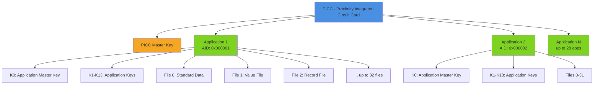

---

## 2. Communication Stack

### 2.1 Protocol Layers

The communication between reader and card follows a layered architecture:

```
┌─────────────────────────────────────────┐
│   Application Layer                      │
│   (DESFire Commands, File Operations)   │
├─────────────────────────────────────────┤
│   DESFire Protocol Layer                │
│   (Command Codes, Response Parsing)     │
├─────────────────────────────────────────┤
│   APDU Layer (ISO 7816-4)               │
│   (CLA, INS, P1, P2, Data, Le)         │
├─────────────────────────────────────────┤
│   Data Link Layer (ISO 14443-4)         │
│   (Block Protocol, CRC)                 │
├─────────────────────────────────────────┤
│   Anti-collision Layer (ISO 14443-3)    │
│   (UID, SAK, ATQA)                      │
├─────────────────────────────────────────┤
│   Physical Layer (ISO 14443-2)          │
│   (13.56 MHz RF, Modulation)            │
└─────────────────────────────────────────┘
```

### 2.2 Communication Flow

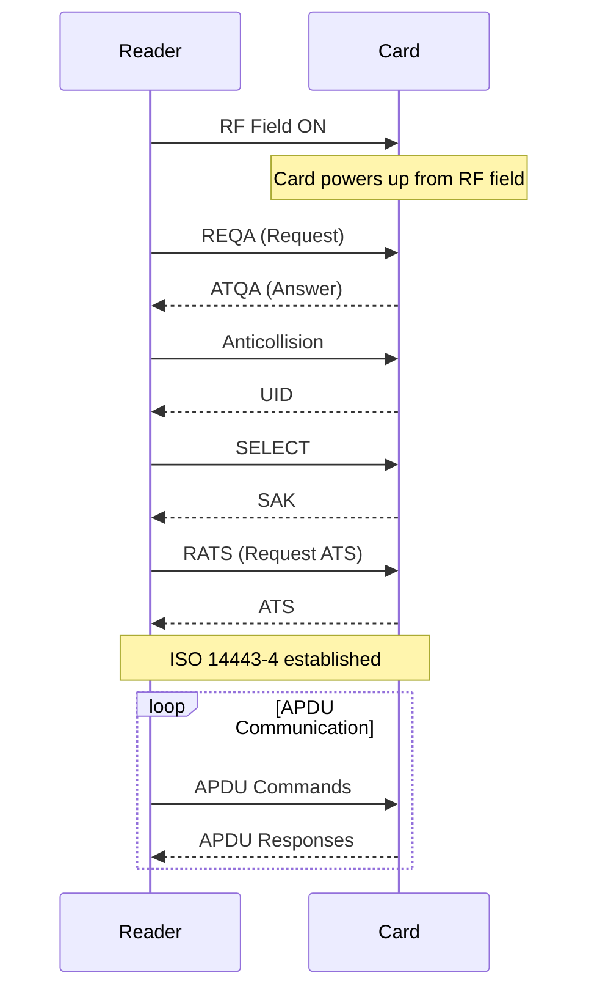

---

## 3. Physical Layer (NFC/ISO 14443)

### 3.1 NFC Technology

**Frequency**: 13.56 MHz
**Communication Distance**: ~4 cm
**Data Rate**: 106-424 kbps
**Standard**: ISO 14443 Type A

### 3.2 Card Detection Process

#### Step 1: Field Detection
When the reader activates its RF field, the card detects the field and powers up using energy harvested from the RF signal.

#### Step 2: Anti-collision
The reader executes the anti-collision sequence to identify the card's UID (Unique Identifier):

```typescript
// Card responds with ATQA (Answer To Request Type A)
REQA  -> 0x26
ATQA  <- 0x44 0x00 (for DESFire)

// Anti-collision and UID retrieval
ANTICOLLISION -> 0x93 0x20
UID           <- [7 bytes for DESFire EV2/EV3]

// Selection
SELECT -> 0x93 0x70 + [UID]
SAK    <- 0x20 (indicates ISO 14443-4 compliance)
```

#### Step 3: Protocol Activation
```typescript
// Request for Answer To Select (RATS)
RATS -> 0xE0 0x50
ATS  <- [Answer To Select with protocol parameters]
```

### 3.3 Data Encoding

**Modulation**:
- Reader to Card: 100% ASK (Amplitude Shift Keying)
- Card to Reader: Load modulation (subcarrier)

**Bit Encoding**: Modified Miller (Reader to Card), Manchester (Card to Reader)

---

## 4. APDU Layer (ISO 7816-4)

### 4.1 APDU Structure

An APDU (Application Protocol Data Unit) is the fundamental unit of communication:

#### Command APDU Structure

```
┌─────┬─────┬─────┬─────┬─────┬──────────┬─────┐
│ CLA │ INS │ P1  │ P2  │ Lc  │   Data   │ Le  │
└─────┴─────┴─────┴─────┴─────┴──────────┴─────┘
  1B    1B    1B    1B    1B    0-255B     1B
```

**Fields**:
- **CLA** (Class Byte): `0x90` for DESFire native commands
- **INS** (Instruction): DESFire command code
- **P1, P2** (Parameters): Always `0x00` for DESFire native
- **Lc** (Length of Command Data): Number of data bytes to send
- **Data**: Command parameters/payload
- **Le** (Expected Response Length): `0x00` means 256 bytes max

#### Response APDU Structure

```
┌──────────────┬──────┬──────┐
│     Data     │ SW1  │ SW2  │
└──────────────┴──────┴──────┘
   0-256 bytes   1B     1B
```

**Status Words (SW1 SW2)**:
- `0x9000`: Success (Operation completed)
- `0x91AF`: Additional Frame (More data to follow)
- `0x91xx`: DESFire-specific status codes
- `0x6xxx`: ISO 7816-4 error codes

### 4.2 APDU Cases

#### Case 1: No Command Data, No Response Data
```
[CLA][INS][P1][P2]
```
Example: `90 FC 00 00` (Format PICC)

#### Case 2: No Command Data, Response Data Expected
```
[CLA][INS][P1][P2][Le]
```
Example: `90 60 00 00 00` (Get Version)

#### Case 3: Command Data, No Response Data
```
[CLA][INS][P1][P2][Lc][Data]
```
Example: `90 5A 00 00 03 00 00 00` (Select Application 0x000000)

#### Case 4: Command Data, Response Data Expected
```
[CLA][INS][P1][P2][Lc][Data][Le]
```
Example: `90 BD 00 00 07 00 00 00 00 14 00 00 00` (Read Data from file 0)

### 4.3 APDU Implementation

From `src/card/apdu.ts`:

```typescript
static build(
  cla: number,    // Class byte (0x90 for DESFire)
  ins: number,    // Instruction (DESFire command)
  p1: number,     // Parameter 1 (usually 0x00)
  p2: number,     // Parameter 2 (usually 0x00)
  data?: Buffer,  // Optional command data
  le?: number     // Optional expected length
): Buffer {
  const header = Buffer.from([cla, ins, p1, p2]);

  // Case 1: No data, no response
  if (!data && le === undefined) {
    return header;
  }

  // Case 2: No data, with expected response
  if (!data && le !== undefined) {
    return Buffer.concat([header, Buffer.from([le])]);
  }

  // Case 3: With data, no response
  if (data && le === undefined) {
    const lc = Buffer.from([data.length]);
    return Buffer.concat([header, lc, data]);
  }

  // Case 4: With data and expected response
  const lc = Buffer.from([data.length]);
  const leBuffer = Buffer.from([le as number]);
  return Buffer.concat([header, lc, data, leBuffer]);
}
```

### 4.4 Status Code Mapping

From `src/card/apdu.ts`:

```typescript
// Success codes
0x9000: 'SUCCESS'              // Operation completed successfully
0x91AF: 'ADDITIONAL_FRAME'     // More data follows
0x9100: 'NO_CHANGES'           // Operation had no effect

// DESFire specific errors
0x919C: 'OUT_OF_MEMORY'        // Card memory full
0x919E: 'ILLEGAL_COMMAND'      // Command not supported
0x919D: 'INTEGRITY_ERROR'      // CRC/MAC verification failed
0x91A0: 'NO_SUCH_KEY'          // Key number doesn't exist
0x91A1: 'LENGTH_ERROR'         // Wrong data length
0x917E: 'LENGTH_ERROR'         // Wrong length (alternative code)
0x91AE: 'AUTHENTICATION_ERROR' // Authentication failed
0x91BE: 'BOUNDARY_ERROR'       // Out of bounds access
0x91C1: 'PICC_INTEGRITY_ERROR' // Card data corrupted
0x91CA: 'COMMAND_ABORTED'      // Operation cancelled
0x91CD: 'PICC_DISABLED_ERROR'  // Card is disabled
0x91CE: 'COUNT_ERROR'          // Counter limit reached
0x91DE: 'DUPLICATE_ERROR'      // Already exists
0x91EE: 'EEPROM_ERROR'         // Storage error
0x91F0: 'FILE_NOT_FOUND'       // File doesn't exist
0x91FE: 'FILE_INTEGRITY_ERROR' // File data corrupted
```

---

## 5. DESFire Protocol Layer

### 5.1 DESFire Command Set

From `src/card/desfire.ts`:

```typescript
enum DesfireCommand {
  // PICC Level Commands
  GET_VERSION                = 0x60,
  GET_CARD_UID              = 0x51,
  FORMAT_PICC               = 0xFC,

  // Application Level Commands
  GET_APPLICATION_IDS        = 0x6A,
  CREATE_APPLICATION        = 0xCA,
  DELETE_APPLICATION        = 0xDA,
  SELECT_APPLICATION        = 0x5A,

  // File Management Commands
  GET_FILE_IDS              = 0x6F,
  GET_FILE_SETTINGS         = 0xF5,
  CREATE_STD_DATA_FILE      = 0xCD,
  CREATE_BACKUP_DATA_FILE   = 0xCB,
  CREATE_VALUE_FILE         = 0xCC,
  CREATE_LINEAR_RECORD_FILE = 0xC1,
  DELETE_FILE               = 0xDF,

  // Data Manipulation Commands
  READ_DATA                 = 0xBD,
  WRITE_DATA                = 0x3D,
  GET_VALUE                 = 0x6C,
  CREDIT                    = 0x0C,
  DEBIT                     = 0xDC,
  WRITE_RECORD              = 0x3B,
  READ_RECORDS              = 0xBB,
  COMMIT_TRANSACTION        = 0xC7,
  ABORT_TRANSACTION         = 0xA7,

  // Security Commands
  AUTHENTICATE              = 0x0A,  // Legacy DES/3DES
  AUTHENTICATE_ISO          = 0x1A,  // ISO authentication
  AUTHENTICATE_AES          = 0xAA,  // AES authentication (EV1)
  AUTHENTICATE_EV2_FIRST    = 0x71,  // EV2 First authentication
  AUTHENTICATE_EV2_NON_FIRST= 0x77,  // EV2 Non-First authentication
  CHANGE_KEY                = 0xC4,  // Legacy key change
  CHANGE_KEY_EV2            = 0xC6,  // EV2 secure key change
  GET_KEY_SETTINGS          = 0x45,
  CHANGE_KEY_SETTINGS       = 0x54,
  GET_KEY_VERSION           = 0x64,

  // Key Rollover Commands
  INITIALIZE_KEY_SET        = 0x56,
  ROLL_KEY_SET              = 0x55,
  FINALIZE_KEY_SET          = 0x57,

  // Additional Commands
  ADDITIONAL_FRAME          = 0xAF,  // Continue multi-frame transfer
  GET_FREE_MEMORY           = 0x6E,
}
```

### 5.2 Command Categories

#### PICC-Level Commands
Commands that operate at the card level (before selecting an application):

- **GET_VERSION**: Retrieve hardware/software version and UID
- **FORMAT_PICC**: Erase all applications (requires PICC Master Key authentication)
- **CREATE_APPLICATION**: Create a new application
- **DELETE_APPLICATION**: Remove an application
- **GET_APPLICATION_IDS**: List all applications on the card

#### Application-Level Commands
Commands that operate within a selected application:

- **SELECT_APPLICATION**: Switch to an application context
- **File Management**: Create, delete, configure files
- **Data Operations**: Read, write, credit, debit
- **Key Management**: Change keys, get key settings
- **Authentication**: Authenticate with application keys

### 5.3 Additional Frame Mechanism

DESFire uses a multi-frame protocol for large data transfers:

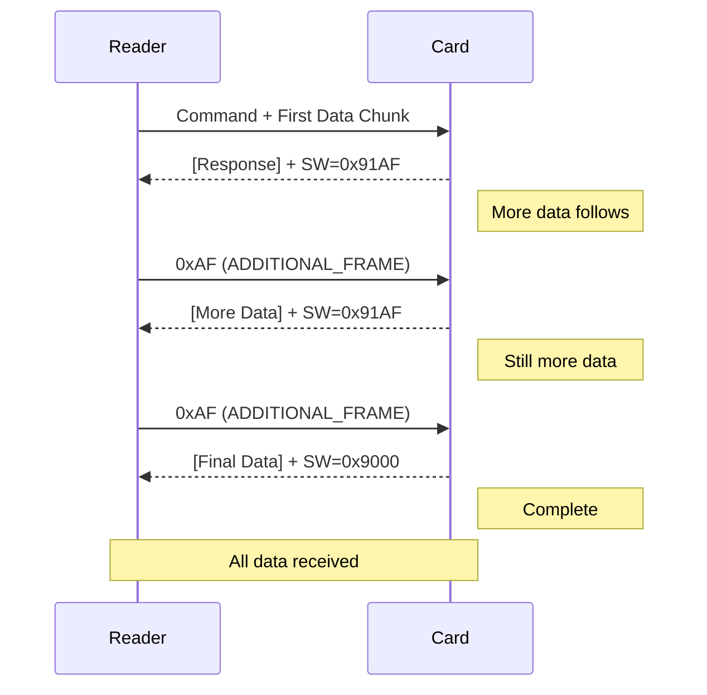

Implementation from `src/card/desfire.ts`:

```typescript
private async getAdditionalFrame(): Promise<Buffer> {
  const attempts = this.preferNoLe
    ? [
        { apdu: Buffer.from([0x90, DesfireCommand.ADDITIONAL_FRAME, 0x00, 0x00]),
          usesLe: false },
        { apdu: Buffer.from([0x90, DesfireCommand.ADDITIONAL_FRAME, 0x00, 0x00, 0x00]),
          usesLe: true },
      ]
    : [
        { apdu: Buffer.from([0x90, DesfireCommand.ADDITIONAL_FRAME, 0x00, 0x00, 0x00]),
          usesLe: true },
        { apdu: Buffer.from([0x90, DesfireCommand.ADDITIONAL_FRAME, 0x00, 0x00]),
          usesLe: false },
      ];

  const parsed = await this.tryTransmitAttempts(attempts);

  // Recursively fetch additional frames if needed
  if (APDU.isAdditionalFrame(parsed.sw1, parsed.sw2)) {
    const additionalData = await this.getAdditionalFrame();
    return Buffer.concat([parsed.data, additionalData]);
  }

  return parsed.data;
}
```

---

## 6. Authentication Protocols

### 6.1 Overview

DESFire cards support multiple authentication protocols for backward compatibility:

| Protocol | Card Version | Key Type | Security Level |
|----------|--------------|----------|----------------|
| Legacy DES/3DES | EV1/EV2/EV3 | DES, 3DES | Low (deprecated) |
| AuthenticateAES | EV1/EV2/EV3 | AES-128 | Medium |
| AuthenticateEV2First | EV2/EV3 | AES-128 | High (recommended) |
| AuthenticateEV2NonFirst | EV2/EV3 | AES-128 | High |

### 6.2 Authentication Purpose

Authentication serves multiple purposes:

1. **Mutual Authentication**: Both card and reader prove they possess the same secret key
2. **Session Key Establishment**: Generate temporary keys for the current session
3. **Access Control**: Grant permissions based on authenticated key number
4. **Secure Messaging**: Enable encrypted/authenticated communication

### 6.3 Legacy DES/3DES Authentication (0x0A)

**Protocol Flow**:

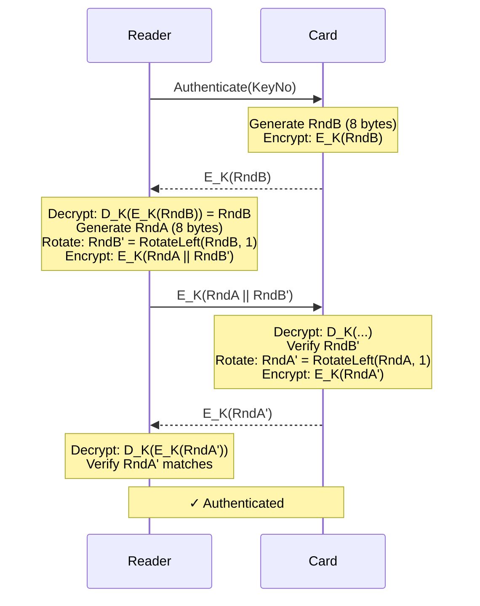

**Implementation** (from `src/card/desfire.ts`):

```typescript
async authenticateDES(keyNo: number, key?: Buffer): Promise<void> {
  const authKey = key || Buffer.alloc(16, 0x00); // Factory default: all zeros

  // Step 1: Send AUTHENTICATE command with key number
  const cmd1 = Buffer.from([keyNo]);
  const resp1 = await this.sendCommand(DesfireCommand.AUTHENTICATE, cmd1);
  const encRndB = resp1.data.slice(0, 8);

  // Step 2: Decrypt RndB
  const rndB = this.des3Decrypt(encRndB, authKey, Buffer.alloc(8, 0x00));

  // Step 3: Generate RndA and prepare challenge
  const rndA = CryptoUtils.generateRandom(8);
  const rndBPrime = CryptoUtils.rotateLeft(rndB, 1);
  const challenge = Buffer.concat([rndA, rndBPrime]);

  // Step 4: Encrypt challenge with IV = encRndB
  const encChallenge = this.des3Encrypt(challenge, authKey, encRndB.slice(-8));

  // Step 5: Send encrypted challenge
  const resp2 = await this.sendCommand(DesfireCommand.ADDITIONAL_FRAME, encChallenge);
  const encRndAPrime = resp2.data.slice(0, 8);

  // Step 6: Verify RndA'
  const rndAPrime = this.des3Decrypt(encRndAPrime, authKey, encChallenge.slice(-8));
  const expectedRndAPrime = CryptoUtils.rotateLeft(rndA, 1);

  if (!rndAPrime.equals(expectedRndAPrime)) {
    throw new Error('Authentication failed: RndA verification failed');
  }

  this.authenticated = true;
  this.authenticatedKeyNo = keyNo;
  console.log(`✓ Authenticated (DES/3DES) with key ${keyNo}`);
}
```

**Note**: This protocol is considered insecure and should only be used for compatibility with legacy systems.

### 6.4 AES Authentication (0xAA)

**Protocol Flow**:

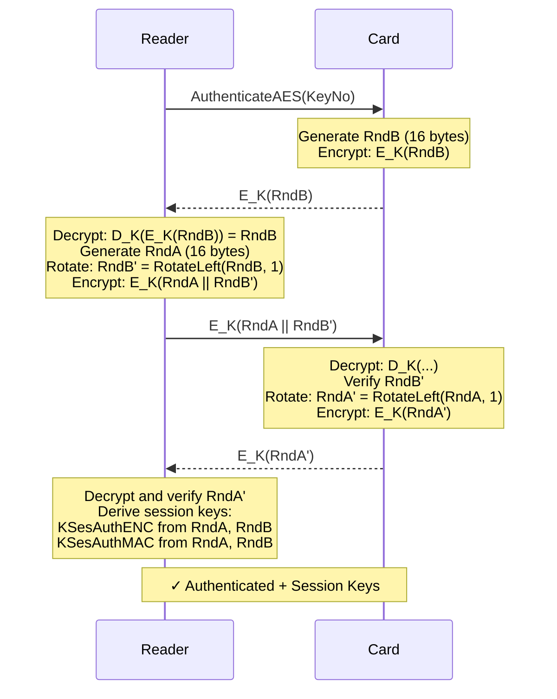

**Session Key Derivation** (from `src/card/crypto.ts`):

```typescript
// Encryption session key
// KSesAuthENC = RndA[0..3] || RndB[0..3] || RndA[12..15] || RndB[12..15]
export function deriveSessionKeyAESEnc(key: Buffer, rndA: Buffer, rndB: Buffer): Buffer {
  return Buffer.concat([
    rndA.slice(0, 4),
    rndB.slice(0, 4),
    rndA.slice(12, 16),
    rndB.slice(12, 16)
  ]);
}

// MAC session key
// KSesAuthMAC = RndA[4..7] || RndB[4..7] || RndA[8..11] || RndB[8..11]
export function deriveSessionKeyAESMac(key: Buffer, rndA: Buffer, rndB: Buffer): Buffer {
  return Buffer.concat([
    rndA.slice(4, 8),
    rndB.slice(4, 8),
    rndA.slice(8, 12),
    rndB.slice(8, 12)
  ]);
}
```

**Implementation** (from `src/card/desfire.ts`):

```typescript
async authenticateAES(keyNo: number, key?: Buffer): Promise<void> {
  // Get authentication key
  const authKey = key || this.keyManager?.getKey(this.currentApp!, keyNo);
  if (!authKey || authKey.length !== 16) {
    throw new Error('AES key must be 16 bytes');
  }

  this.resetAuth();

  // Step 1: Send Authenticate command
  const authCmd = Buffer.from([keyNo]);
  const response1 = await this.sendCommand(DesfireCommand.AUTHENTICATE_AES, authCmd);

  if (response1.length !== 16) {
    throw new Error(`Expected 16 bytes RndB, got ${response1.length}`);
  }

  // Step 2: Decrypt RndB
  const encRndB = response1;
  const rndB = CryptoUtils.aesDecrypt(authKey, encRndB, Buffer.alloc(16, 0x00));

  // Step 3: Generate RndA
  const rndA = CryptoUtils.generateRandom(16);

  // Step 4: Create and encrypt challenge
  const rndBPrime = CryptoUtils.rotateLeft(rndB, 1);
  const challenge = Buffer.concat([rndA, rndBPrime]);
  const encChallenge = CryptoUtils.aesEncrypt(authKey, challenge, Buffer.alloc(16, 0x00));

  // Step 5: Send challenge
  const response2 = await this.sendCommand(DesfireCommand.ADDITIONAL_FRAME, encChallenge);

  if (response2.length !== 16) {
    throw new Error(`Expected 16 bytes encrypted RndA', got ${response2.length}`);
  }

  // Step 6: Verify RndA'
  const decryptedRndAPrime = CryptoUtils.aesDecrypt(authKey, response2, Buffer.alloc(16, 0x00));
  const expectedRndAPrime = CryptoUtils.rotateLeft(rndA, 1);

  if (!decryptedRndAPrime.equals(expectedRndAPrime)) {
    throw new Error('Authentication failed: RndA verification failed');
  }

  // Step 7: Derive session keys
  this.sessionKeyEnc = CryptoUtils.deriveSessionKeyAESEnc(authKey, rndA, rndB);
  this.sessionKeyMac = CryptoUtils.deriveSessionKeyAESMac(authKey, rndA, rndB);

  this.authenticated = true;
  this.authenticatedKeyNo = keyNo;
  this.commandCounter = 0;

  console.log(`✓ Authenticated with key ${keyNo}`);
}
```

### 6.5 EV2 First Authentication (0x71) - Recommended

**Protocol Flow**:

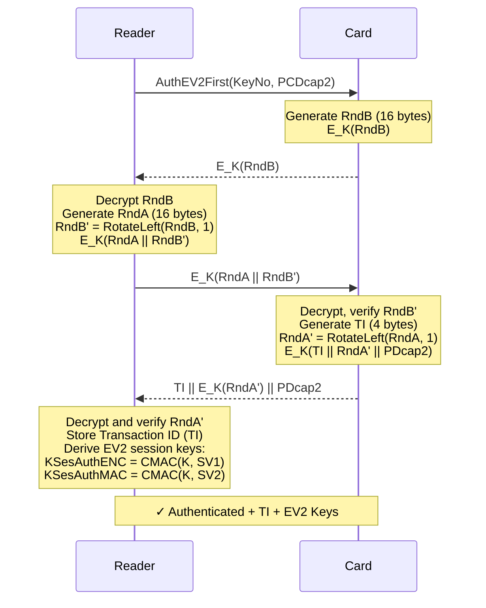

**Key Differences from Legacy AES**:

1. **Transaction Identifier (TI)**: 4-byte random value for tracking the authentication session
2. **CMAC-based Key Derivation**: Uses AES-CMAC instead of simple concatenation
3. **Enhanced Security**: More robust against cryptanalytic attacks
4. **Capability Exchange**: PCDcap2 and PDcap2 for negotiating features

**EV2 Session Key Derivation** (from `src/card/crypto.ts`):

```typescript
// EV2 Encryption Key Derivation using CMAC
export function deriveSessionKeyEV2Enc(key: Buffer, rndA: Buffer, rndB: Buffer): Buffer {
  // SV1 = 0xA5 || 0x5A || 0x00 || 0x01 || 0x00 || 0x80 ||
  //       RndA[0..1] || RndB[0..1] || RndA[13..15] || RndB[13..15]
  const sv1 = Buffer.concat([
    Buffer.from([0xA5, 0x5A, 0x00, 0x01, 0x00, 0x80]),
    rndA.slice(0, 2),
    rndB.slice(0, 2),
    rndA.slice(13, 16),
    rndB.slice(13, 16)
  ]);

  return aesCMAC(key, sv1, 16);
}

// EV2 MAC Key Derivation using CMAC
export function deriveSessionKeyEV2Mac(key: Buffer, rndA: Buffer, rndB: Buffer): Buffer {
  // SV2 = 0x5A || 0xA5 || 0x00 || 0x01 || 0x00 || 0x80 ||
  //       RndA[0..1] || RndB[0..1] || RndA[13..15] || RndB[13..15]
  const sv2 = Buffer.concat([
    Buffer.from([0x5A, 0xA5, 0x00, 0x01, 0x00, 0x80]),
    rndA.slice(0, 2),
    rndB.slice(0, 2),
    rndA.slice(13, 16),
    rndB.slice(13, 16)
  ]);

  return aesCMAC(key, sv2, 16);
}
```

**Implementation** (from `src/card/desfire.ts`):

```typescript
async authenticateEV2First(keyNo: number, key?: Buffer): Promise<void> {
  const authKey = key || this.keyManager?.getKey(this.currentApp!, keyNo);
  if (!authKey || authKey.length !== 16) {
    throw new Error('AES key must be 16 bytes');
  }

  this.resetAuth();

  // Step 1: Send AuthenticateEV2First with PCDcap2 = 0x0000
  const authCmd = Buffer.from([keyNo, 0x00, 0x00]);
  const response1 = await this.sendCommand(DesfireCommand.AUTHENTICATE_EV2_FIRST, authCmd);

  if (response1.length < 16) {
    throw new Error(`Expected at least 16 bytes, got ${response1.length}`);
  }

  // Step 2: Decrypt RndB
  const encRndB = response1.slice(0, 16);
  const rndB = CryptoUtils.aesDecrypt(authKey, encRndB, Buffer.alloc(16, 0x00));

  // Step 3: Generate RndA and create challenge
  const rndA = CryptoUtils.generateRandom(16);
  const rndBPrime = CryptoUtils.rotateLeft(rndB, 1);
  const challenge = Buffer.concat([rndA, rndBPrime]);
  const encChallenge = CryptoUtils.aesEncrypt(authKey, challenge, Buffer.alloc(16, 0x00));

  // Step 4: Send challenge
  const response2 = await this.sendCommand(DesfireCommand.ADDITIONAL_FRAME, encChallenge);

  if (response2.length < 4) {
    throw new Error(`Expected at least 4 bytes TI + encrypted data, got ${response2.length}`);
  }

  // Step 5: Extract Transaction Identifier
  this.transactionId = response2.slice(0, 4);

  // Step 6: Verify RndA'
  const encRndAPrime = response2.slice(4, 20);
  const decryptedRndAPrime = CryptoUtils.aesDecrypt(authKey, encRndAPrime, Buffer.alloc(16, 0x00));
  const expectedRndAPrime = CryptoUtils.rotateLeft(rndA, 1);

  if (!decryptedRndAPrime.equals(expectedRndAPrime)) {
    throw new Error('Authentication failed: RndA verification failed');
  }

  // Step 7: Derive EV2 session keys using CMAC
  this.sessionKeyEnc = CryptoUtils.deriveSessionKeyEV2Enc(authKey, rndA, rndB);
  this.sessionKeyMac = CryptoUtils.deriveSessionKeyEV2Mac(authKey, rndA, rndB);

  this.authenticated = true;
  this.authenticatedKeyNo = keyNo;
  this.commandCounter = 0;

  console.log(`✓ Authenticated with key ${keyNo} (EV2 First)`);
  console.log(`  Transaction ID: ${this.transactionId.toString('hex')}`);
}
```

### 6.6 EV2 Non-First Authentication (0x77)

Used for authenticating with additional keys after an initial EV2 First authentication. Reuses the Transaction ID from the first authentication.

**Use Case**: Authenticate with multiple keys in a single session (e.g., authenticate with master key, then with a specific file access key).

---

## 7. Session Key Derivation

### 7.1 Purpose of Session Keys

Session keys are temporary cryptographic keys derived during authentication:

- **Session Encryption Key (KSesAuthENC)**: Used to encrypt/decrypt data
- **Session MAC Key (KSesAuthMAC)**: Used to authenticate commands and responses

### 7.2 Legacy AES Session Keys

```typescript
// From random values RndA (16 bytes) and RndB (16 bytes):

KSesAuthENC = RndA[0..3]  || RndB[0..3]  || RndA[12..15] || RndB[12..15]
              └─ 4 bytes ─┘  └─ 4 bytes ─┘  └─ 4 bytes ──┘  └─ 4 bytes ──┘
                                    Total: 16 bytes

KSesAuthMAC = RndA[4..7]  || RndB[4..7]  || RndA[8..11]  || RndB[8..11]
              └─ 4 bytes ─┘  └─ 4 bytes ─┘  └─ 4 bytes ──┘  └─ 4 bytes ──┘
                                    Total: 16 bytes
```

**Example**:
```
RndA = A1 A2 A3 A4 | A5 A6 A7 A8 | A9 AA AB AC | AD AE AF B0
       [0..3]        [4..7]        [8..11]       [12..15]

RndB = B1 B2 B3 B4 | B5 B6 B7 B8 | B9 BA BB BC | BD BE BF C0
       [0..3]        [4..7]        [8..11]       [12..15]

KSesAuthENC = A1 A2 A3 A4 B1 B2 B3 B4 AD AE AF B0 BD BE BF C0
KSesAuthMAC = A5 A6 A7 A8 B5 B6 B7 B8 A9 AA AB AC B9 BA BB BC
```

### 7.3 EV2 Session Keys (CMAC-based)

EV2 uses AES-CMAC for more secure session key derivation:

```typescript
// Session Vector 1 (for Encryption Key)
SV1 = 0xA5 0x5A 0x00 0x01 0x00 0x80 || RndA[0..1] || RndB[0..1] || RndA[13..15] || RndB[13..15]
      └────── Header (6 bytes) ─────┘  └── 2B ──┘  └── 2B ──┘  └──── 3B ────┘  └──── 3B ────┘
                                                 Total: 16 bytes

KSesAuthENC = AES-CMAC(K, SV1) [16 bytes]

// Session Vector 2 (for MAC Key)
SV2 = 0x5A 0xA5 0x00 0x01 0x00 0x80 || RndA[0..1] || RndB[0..1] || RndA[13..15] || RndB[13..15]
      └────── Header (6 bytes) ─────┘  └── 2B ──┘  └── 2B ──┘  └──── 3B ────┘  └──── 3B ────┘

KSesAuthMAC = AES-CMAC(K, SV2) [16 bytes]
```

**Example**:
```
K    = 01 23 45 67 89 AB CD EF 01 23 45 67 89 AB CD EF  (Authentication Key)
RndA = A1 A2 A3 A4 A5 A6 A7 A8 A9 AA AB AC AD AE AF B0
RndB = B1 B2 B3 B4 B5 B6 B7 B8 B9 BA BB BC BD BE BF C0

SV1  = A5 5A 00 01 00 80 | A1 A2 | B1 B2 | AE AF B0 | BE BF C0
KSesAuthENC = AES-CMAC(K, SV1) = [calculated 16-byte result]

SV2  = 5A A5 00 01 00 80 | A1 A2 | B1 B2 | AE AF B0 | BE BF C0
KSesAuthMAC = AES-CMAC(K, SV2) = [calculated 16-byte result]
```

### 7.4 AES-CMAC Algorithm

From `src/card/crypto.ts`:

```typescript
export function aesCMAC(key: Buffer, data: Buffer, length?: number): Buffer {
  if (key.length !== 16) {
    throw new Error('Key must be 16 bytes for AES-128');
  }

  const { k1, k2 } = generateCMACSubkeys(key);

  // Determine output length (full 16 bytes or truncated)
  const outputLength = length || 16;

  // Pad data if necessary
  let paddedData: Buffer;
  const blockSize = 16;
  const numBlocks = Math.ceil(data.length / blockSize);

  if (data.length === 0 || data.length % blockSize !== 0) {
    // Incomplete block - use padding
    paddedData = Buffer.alloc(numBlocks * blockSize, 0x00);
    data.copy(paddedData);
    if (data.length < paddedData.length) {
      paddedData[data.length] = 0x80; // Padding bit
    }

    // XOR last block with K2
    for (let i = 0; i < 16; i++) {
      paddedData[paddedData.length - 16 + i] ^= k2[i];
    }
  } else {
    // Complete blocks - XOR last block with K1
    paddedData = Buffer.from(data);
    for (let i = 0; i < 16; i++) {
      paddedData[paddedData.length - 16 + i] ^= k1[i];
    }
  }

  // CBC-MAC calculation
  const cipher = crypto.createCipheriv('aes-128-ecb', key, Buffer.alloc(0));
  cipher.setAutoPadding(false);

  let mac = Buffer.alloc(16, 0x00);

  for (let i = 0; i < paddedData.length; i += 16) {
    const block = paddedData.slice(i, i + 16);

    // XOR with previous MAC
    for (let j = 0; j < 16; j++) {
      mac[j] ^= block[j];
    }

    // Encrypt
    const encrypted = cipher.update(mac);
    encrypted.copy(mac);
  }

  return mac.slice(0, outputLength);
}
```

---

## 8. Cryptographic Operations

### 8.1 AES Encryption/Decryption

DESFire uses **AES-128 in CBC mode** for encryption:

```typescript
// AES-128-CBC Encryption
export function aesEncrypt(
  key: Buffer,                  // 16-byte AES key
  data: Buffer,                 // Plaintext data (must be multiple of 16 bytes)
  iv: Buffer = Buffer.alloc(16, 0x00)  // Initialization vector
): Buffer {
  const cipher = crypto.createCipheriv('aes-128-cbc', key, iv);
  cipher.setAutoPadding(false);  // Manual padding required
  return Buffer.concat([cipher.update(data), cipher.final()]);
}

// AES-128-CBC Decryption
export function aesDecrypt(
  key: Buffer,
  data: Buffer,
  iv: Buffer = Buffer.alloc(16, 0x00)
): Buffer {
  const decipher = crypto.createDecipheriv('aes-128-cbc', key, iv);
  decipher.setAutoPadding(false);
  return Buffer.concat([decipher.update(data), decipher.final()]);
}
```

**CBC Mode Operation**:
```
Encryption:
C[0] = E_K(P[0] XOR IV)
C[1] = E_K(P[1] XOR C[0])
C[2] = E_K(P[2] XOR C[1])
...

Decryption:
P[0] = D_K(C[0]) XOR IV
P[1] = D_K(C[1]) XOR C[0]
P[2] = D_K(C[2]) XOR C[1]
...
```

### 8.2 Data Padding

**ISO/IEC 9797-1 Method 2 Padding**:

```typescript
export function padData(data: Buffer, blockSize: number = 16): Buffer {
  const paddingLength = blockSize - (data.length % blockSize);
  const padding = Buffer.alloc(paddingLength);
  padding[0] = 0x80;  // First padding byte is 0x80
  // Rest are 0x00
  return Buffer.concat([data, padding]);
}

export function unpadData(data: Buffer): Buffer {
  // Find last 0x80 byte and remove padding
  for (let i = data.length - 1; i >= 0; i--) {
    if (data[i] === 0x80) {
      return data.slice(0, i);
    }
    if (data[i] !== 0x00) {
      return data;  // No valid padding found
    }
  }
  return data;
}
```

**Example**:
```
Input:  [01 02 03 04 05]           (5 bytes)
Padded: [01 02 03 04 05 80 00 00 00 00 00 00 00 00 00 00]  (16 bytes)

Input:  [01 02 03 04 05 06 07 08 09 0A 0B 0C 0D 0E 0F 10]  (16 bytes)
Padded: [01 02 03 ... 10 80 00 00 00 00 00 00 00 00 00 00 00 00 00 00 00]  (32 bytes)
```

### 8.3 CRC Calculations

#### CRC32 (for data integrity)

```typescript
export function crc32(data: Buffer): number {
  const polynomial = 0xEDB88320;
  let crc = 0xFFFFFFFF;

  for (let i = 0; i < data.length; i++) {
    crc ^= data[i];
    for (let j = 0; j < 8; j++) {
      crc = (crc & 1) ? (crc >>> 1) ^ polynomial : crc >>> 1;
    }
  }

  return (~crc) >>> 0;
}

export function crc32Buffer(data: Buffer): Buffer {
  const crc = crc32(data);
  const buffer = Buffer.allocUnsafe(4);
  buffer.writeUInt32LE(crc, 0);  // Little-endian
  return buffer;
}
```

#### CRC16 (ISO 14443-3 Type A)

```typescript
export function crc16(data: Buffer): number {
  const polynomial = 0x8408;
  let crc = 0x6363;  // Initial value for ISO 14443

  for (let i = 0; i < data.length; i++) {
    crc ^= data[i];
    for (let j = 0; j < 8; j++) {
      crc = (crc & 1) ? (crc >>> 1) ^ polynomial : crc >>> 1;
    }
  }

  return crc & 0xFFFF;
}
```

### 8.4 Rotate Operation

Used during authentication to prove possession of random values:

```typescript
export function rotateLeft(buffer: Buffer, bytes: number = 1): Buffer {
  const result = Buffer.alloc(buffer.length);
  for (let i = 0; i < buffer.length; i++) {
    result[i] = buffer[(i + bytes) % buffer.length];
  }
  return result;
}
```

**Example**:
```
Input:  [A1 A2 A3 A4 A5 A6 A7 A8]
Rotate Left 1: [A2 A3 A4 A5 A6 A7 A8 A1]
```

### 8.5 Random Number Generation

```typescript
export function generateRandom(length: number): Buffer {
  return crypto.randomBytes(length);
}
```

Uses cryptographically secure random number generation for authentication challenges.

---

## 9. File Operations

### 9.1 File Types

DESFire supports four types of files:

| File Type | Description | Use Case | Max Size |
|-----------|-------------|----------|----------|
| **Standard Data File** | Simple read/write storage | Configuration, user data | 256 bytes |
| **Backup Data File** | Transactional storage with commit/abort | Critical data requiring atomic updates | 256 bytes |
| **Value File** | 32-bit signed integer with credit/debit | Balance, counters | 4 bytes |
| **Record File** | Append-only log (linear or cyclic) | Transaction history, audit logs | Variable |

### 9.2 File Access Rights

Each file has a 2-byte access rights field:

```
Byte 0: [RW nibble] [CAR nibble]
Byte 1: [R nibble] [W nibble]

RW  = ReadWrite access (requires this key for both read and write)
CAR = Change Access Rights (requires this key to modify access rights)
R   = Read access
W   = Write access

Each nibble (4 bits) specifies a key number (0-13) or special value:
0x0-0xD: Key number 0-13
0xE:     Free access (no authentication required)
0xF:     No access (operation denied)
```

**Example**:
```typescript
// Access Rights: [0x12] [0x34]
// RW = 0x1 (Key 1), CAR = 0x2 (Key 2)
// R = 0x3 (Key 3), W = 0x4 (Key 4)

const accessRights = Buffer.from([0x12, 0x34]);

// Another example: Free read, Key 1 write
// R = 0xE (free), W = 0x1 (key 1), RW = 0xF (none), CAR = 0x0 (key 0)
const accessRights2 = Buffer.from([0xF0, 0xE1]);
```

### 9.3 Create Standard Data File

```typescript
async createStdDataFile(
  fileNo: number,           // File number (0-31)
  commSettings: number,     // Communication settings (0=plain, 1=MAC, 3=encrypted)
  accessRights: Buffer,     // 2-byte access rights
  fileSize: number          // Size in bytes (1-256)
): Promise<void> {
  const fileSizeBuffer = Buffer.allocUnsafe(3);
  fileSizeBuffer.writeUIntLE(fileSize, 0, 3);

  const data = Buffer.concat([
    Buffer.from([fileNo, commSettings]),
    accessRights,
    fileSizeBuffer
  ]);

  await this.sendCommand(DesfireCommand.CREATE_STD_DATA_FILE, data, false);
  console.log(`Standard data file ${fileNo} created (${fileSize} bytes)`);
}
```

**Command Format**:
```
90 CD 00 00 07  [fileNo] [commSettings] [AR1] [AR2] [size_LE_3B]
│  │           │  └─ File number (0-31)
│  │           │     └─ Comm settings (0=plain, 1=MAC, 3=encrypted)
│  │           │        └─ Access rights byte 1
│  │           │           └─ Access rights byte 2
│  │           │              └─ File size (3 bytes, little-endian)
│  │           └─ Data length (7 bytes)
│  └─ CREATE_STD_DATA_FILE command
└─ DESFire class byte
```

### 9.4 Create Value File

```typescript
async createValueFile(
  fileNo: number,
  commSettings: number,
  accessRights: Buffer,
  lowerLimit: number,       // Minimum value (signed 32-bit)
  upperLimit: number,       // Maximum value (signed 32-bit)
  value: number,            // Initial value (signed 32-bit)
  limitedCreditEnabled: number  // 0x00 or 0x01
): Promise<void> {
  const lowerLimitBuffer = Buffer.allocUnsafe(4);
  const upperLimitBuffer = Buffer.allocUnsafe(4);
  const valueBuffer = Buffer.allocUnsafe(4);

  lowerLimitBuffer.writeInt32LE(lowerLimit, 0);
  upperLimitBuffer.writeInt32LE(upperLimit, 0);
  valueBuffer.writeInt32LE(value, 0);

  const data = Buffer.concat([
    Buffer.from([fileNo, commSettings]),
    accessRights,
    lowerLimitBuffer,
    upperLimitBuffer,
    valueBuffer,
    Buffer.from([limitedCreditEnabled])
  ]);

  await this.sendCommand(DesfireCommand.CREATE_VALUE_FILE, data, false);
  console.log(`Value file ${fileNo} created (initial value: ${value})`);
}
```

**Command Format**:
```
90 CC 00 00 11  [fileNo] [commSettings] [AR1] [AR2]
                [lowerLimit_4B_LE] [upperLimit_4B_LE] [value_4B_LE] [limitedCredit]
```

### 9.5 Read Data

```typescript
async readData(fileNo: number, offset: number, length: number): Promise<Buffer> {
  const offsetBuffer = Buffer.allocUnsafe(3);
  const lengthBuffer = Buffer.allocUnsafe(3);

  offsetBuffer.writeUIntLE(offset, 0, 3);
  lengthBuffer.writeUIntLE(length, 0, 3);

  const data = Buffer.concat([
    Buffer.from([fileNo]),
    offsetBuffer,
    lengthBuffer
  ]);

  return await this.sendCommand(DesfireCommand.READ_DATA, data);
}
```

**Command Format**:
```
90 BD 00 00 07  [fileNo] [offset_3B_LE] [length_3B_LE] 00
│  │           │  └─ File number
│  │           │     └─ Offset in file (3 bytes)
│  │           │        └─ Length to read (3 bytes)
│  │           │           └─ Expected response length
│  │           └─ Data length (7 bytes)
│  └─ READ_DATA command
└─ DESFire class byte
```

**Example**:
```
Read 20 bytes from file 0, starting at offset 0:
90 BD 00 00 07  00 00 00 00 14 00 00  00

Response:
[20 bytes of data] 90 00
```

### 9.6 Write Data

```typescript
async writeData(fileNo: number, offset: number, data: Buffer): Promise<void> {
  const offsetBuffer = Buffer.allocUnsafe(3);
  const lengthBuffer = Buffer.allocUnsafe(3);

  offsetBuffer.writeUIntLE(offset, 0, 3);
  lengthBuffer.writeUIntLE(data.length, 0, 3);

  const MAX_CHUNK = 40;  // Conservative chunk size for ACR122U

  let sent = 0;

  // First frame with header + first data chunk
  const firstChunk = data.slice(0, Math.min(data.length, MAX_CHUNK));
  const firstPayload = Buffer.concat([
    Buffer.from([fileNo]),
    offsetBuffer,
    lengthBuffer,
    firstChunk
  ]);

  let parsed = await this.transmitParsed(
    APDU.buildDESFire(DesfireCommand.WRITE_DATA, firstPayload, 0)
  );

  if (!(APDU.isSuccess(parsed.sw1, parsed.sw2) ||
        APDU.isAdditionalFrame(parsed.sw1, parsed.sw2))) {
    throw new Error(`WriteData failed: ${parsed.status}`);
  }

  sent += firstChunk.length;

  // Continue with additional frames if needed
  while (sent < data.length) {
    const remaining = data.length - sent;
    const chunk = data.slice(sent, sent + Math.min(remaining, MAX_CHUNK));

    parsed = await this.transmitParsed(
      APDU.build(0x90, DesfireCommand.ADDITIONAL_FRAME, 0x00, 0x00, chunk, 0)
    );

    if (!(APDU.isSuccess(parsed.sw1, parsed.sw2) ||
          APDU.isAdditionalFrame(parsed.sw1, parsed.sw2))) {
      throw new Error(`WriteData (AF) failed at ${sent}: ${parsed.status}`);
    }

    sent += chunk.length;
  }

  console.log(`Wrote ${data.length} bytes to file ${fileNo} at offset ${offset}`);
}
```

**Command Format** (for data larger than ~40 bytes):
```
Frame 1:
90 3D 00 00 [Lc]  [fileNo] [offset_3B] [length_3B] [first_chunk] 00

Frame 2 (if needed):
90 AF 00 00 [Lc]  [next_chunk] 00

Frame N (last):
90 AF 00 00 [Lc]  [last_chunk] 00

Response (after last frame):
90 00
```

### 9.7 Value File Operations

#### Get Value
```typescript
async getValue(fileNo: number): Promise<number> {
  const data = Buffer.from([fileNo]);
  const response = await this.sendCommand(DesfireCommand.GET_VALUE, data);
  return response.readInt32LE(0);
}
```

**Command**:
```
90 6C 00 00 01  [fileNo] 00
Response: [4-byte signed int, little-endian] 90 00
```

#### Credit (Add Value)
```typescript
async credit(fileNo: number, amount: number): Promise<void> {
  const amountBuffer = Buffer.allocUnsafe(4);
  amountBuffer.writeInt32LE(amount, 0);

  const data = Buffer.concat([
    Buffer.from([fileNo]),
    amountBuffer
  ]);

  await this.sendCommand(DesfireCommand.CREDIT, data, false);
  console.log(`Credited ${amount} to value file ${fileNo}`);
}
```

**Command**:
```
90 0C 00 00 05  [fileNo] [amount_4B_LE]
```

#### Debit (Subtract Value)
```typescript
async debit(fileNo: number, amount: number): Promise<void> {
  const amountBuffer = Buffer.allocUnsafe(4);
  amountBuffer.writeInt32LE(amount, 0);

  const data = Buffer.concat([
    Buffer.from([fileNo]),
    amountBuffer
  ]);

  await this.sendCommand(DesfireCommand.DEBIT, data, false);
  console.log(`Debited ${amount} from value file ${fileNo}`);
}
```

**Command**:
```
90 DC 00 00 05  [fileNo] [amount_4B_LE]
```

### 9.8 Transaction Management

Value file and backup file operations are transactional and require commit/abort:

```typescript
// Commit transaction (make changes permanent)
async commitTransaction(): Promise<void> {
  await this.sendCommand(DesfireCommand.COMMIT_TRANSACTION, undefined, false);
  console.log('Transaction committed');
}

// Abort transaction (rollback changes)
async abortTransaction(): Promise<void> {
  await this.sendCommand(DesfireCommand.ABORT_TRANSACTION, undefined, false);
  console.log('Transaction aborted');
}
```

**Usage Example**:
```typescript
try {
  // Perform operations
  await card.debit(0, 100);  // Debit 100 from file 0
  await card.credit(1, 100); // Credit 100 to file 1

  // Commit if successful
  await card.commitTransaction();
} catch (error) {
  // Abort on error
  await card.abortTransaction();
  throw error;
}
```

---

## 10. Transaction Flows

### 10.1 Card Initialization Flow

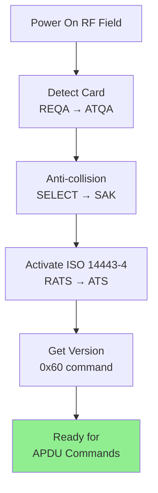

### 10.2 Application Creation Flow

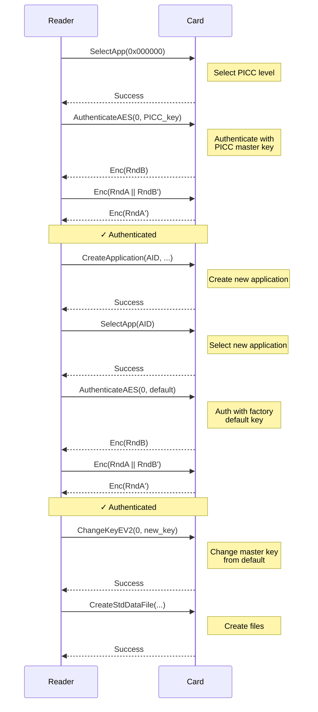

### 10.3 Payment Transaction Flow

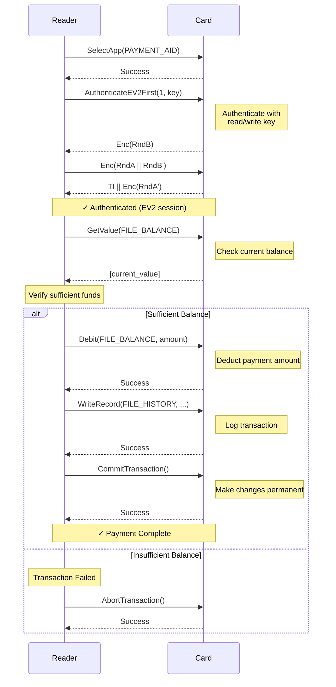

**Error Handling**:
```typescript
try {
  await card.selectApplication(PAYMENT_AID);
  await card.authenticateEV2First(1, paymentKey);

  const balance = await card.getValue(FILE_BALANCE);
  if (balance < amount) {
    throw new Error('Insufficient balance');
  }

  await card.debit(FILE_BALANCE, amount);
  await card.writeRecord(FILE_HISTORY, transactionData);
  await card.commitTransaction();

  console.log('Payment successful');
} catch (error) {
  await card.abortTransaction();
  console.error('Payment failed:', error);
  throw error;
}
```

### 10.4 Key Change Flow

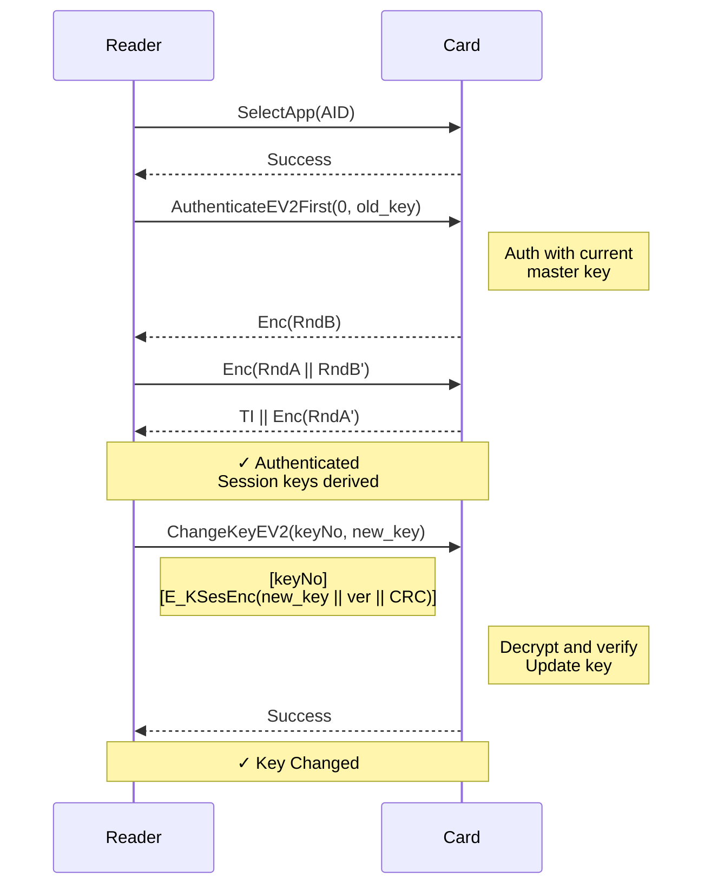

**Secure Key Change Implementation**:

```typescript
async changeKeyEV2(keyNo: number, newKey: Buffer, newKeyVersion: number = 0): Promise<void> {
  if (!this.authenticated || !this.sessionKeyEnc) {
    throw new Error('EV2 authentication required for ChangeKeyEV2');
  }

  if (newKey.length !== 16) {
    throw new Error('AES-128 keys must be 16 bytes');
  }

  // Build change key data
  const keyData = Buffer.concat([
    newKey,
    Buffer.from([newKeyVersion])
  ]);

  // Calculate CRC32 over command + key data
  const crcData = Buffer.concat([
    Buffer.from([DesfireCommand.CHANGE_KEY_EV2, keyNo]),
    keyData
  ]);
  const crc = CryptoUtils.crc32Buffer(crcData);

  // Encrypt: NewKey || NewKeyVersion || CRC32
  const plainData = Buffer.concat([keyData, crc]);
  const encryptedData = CryptoUtils.aesEncrypt(this.sessionKeyEnc, plainData);

  const commandData = Buffer.concat([
    Buffer.from([keyNo]),
    encryptedData
  ]);

  await this.sendCommand(DesfireCommand.CHANGE_KEY_EV2, commandData, false);
  console.log(`✓ Key ${keyNo} changed successfully (version ${newKeyVersion})`);
}
```

### 10.5 Key Rollover Flow (Zero-Downtime)

For EV2/EV3 cards, key rotation can be performed without downtime using keysets:

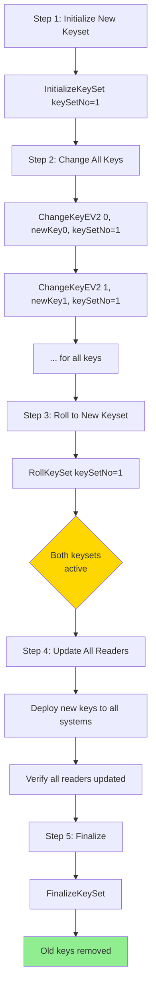

---

## 11. Error Handling

### 11.1 Common Errors

| Error Code | Name | Cause | Solution |
|------------|------|-------|----------|
| 0x919E | ILLEGAL_COMMAND | Command not supported or wrong context | Check card version, ensure correct application selected |
| 0x91A1, 0x917E | LENGTH_ERROR | Wrong data length | Verify command parameters, check Le field |
| 0x91AE | AUTHENTICATION_ERROR | Authentication failed | Verify key, check authentication protocol |
| 0x91F0 | FILE_NOT_FOUND | File doesn't exist | Create file first, check file number |
| 0x919C | OUT_OF_MEMORY | Card memory full | Delete unused files/applications |
| 0x919D | INTEGRITY_ERROR | CRC/MAC verification failed | Check encryption, verify session keys |
| 0x91BE | BOUNDARY_ERROR | Out of bounds access | Check offset/length in read/write |
| 0x91CA | COMMAND_ABORTED | Transaction was aborted | Check transaction state |

### 11.2 Reader Compatibility Issues

#### Le Field Handling

Some readers (like ACR122U) are sensitive to the Le field in APDUs:

```typescript
// Implementation handles this by trying both variants:
const attempts = this.preferNoLe
  ? [
      { apdu: Buffer.from([0x90, cmd, 0x00, 0x00]), usesLe: false },
      { apdu: Buffer.from([0x90, cmd, 0x00, 0x00, 0x00]), usesLe: true },
    ]
  : [
      { apdu: Buffer.from([0x90, cmd, 0x00, 0x00, 0x00]), usesLe: true },
      { apdu: Buffer.from([0x90, cmd, 0x00, 0x00]), usesLe: false },
    ];
```

The implementation remembers which variant worked and prefers it for subsequent commands.

### 11.3 Retry Logic

```typescript
private async transmitParsed(apdu: Buffer): Promise<ParsedResponse> {
  if (process.env.DESFIRE_DEBUG) {
    console.log(`>> ${apdu.toString('hex')}`);
  }

  let response: Buffer;
  try {
    response = await this.reader.transmit(apdu, 256);
  } catch (err) {
    // Retry once after 100ms delay
    await new Promise((r) => setTimeout(r, 100));
    response = await this.reader.transmit(apdu, 256);
  }

  if (process.env.DESFIRE_DEBUG) {
    console.log(`<< ${response.toString('hex')}`);
  }

  return APDU.parse(response);
}
```

### 11.4 Transaction Safety

Always use try-catch with abort on error for transactional operations:

```typescript
try {
  await card.debit(0, amount);
  await card.credit(1, amount);
  await card.commitTransaction();
} catch (error) {
  await card.abortTransaction();
  throw error;
}
```

---

## 12. Implementation Examples

### 12.1 Complete Card Provisioning

```typescript
import { NFCReaderManager } from './card/reader';
import { DESFireCard } from './card/desfire';
import { KeyManager } from './card/keyManager';

async function provisionCard() {
  const readerManager = new NFCReaderManager();

  // Wait for card
  await new Promise((resolve) => {
    readerManager.once('card-detected', resolve);
  });

  const readers = readerManager.getReaders();
  const reader = readers[0];

  const card = new DESFireCard(reader);

  // 1. Get card version
  const version = await card.getVersion();
  console.log('Card UID:', version.uid.toString('hex'));

  // 2. Select PICC level
  await card.selectApplication(0x000000);

  // 3. Authenticate with factory default PICC key
  const defaultKey = Buffer.alloc(16, 0x00);
  await card.authenticateAES(0, defaultKey);

  // 4. Format card (optional - erases all data)
  // await card.formatPICC();

  // 5. Create application
  const APP_ID = 0x000001;
  const KEY_SETTINGS = 0x0F;  // Allow master key to do everything
  const NUM_KEYS = 5;         // K0-K4
  await card.createApplication(APP_ID, KEY_SETTINGS, NUM_KEYS, 0x80);

  // 6. Select new application
  await card.selectApplication(APP_ID);

  // 7. Authenticate with default app key
  await card.authenticateAES(0, defaultKey);

  // 8. Change master key from default
  const keyManager = new KeyManager();
  await keyManager.generateKeyset(APP_ID, NUM_KEYS, 'AES');
  const newMasterKey = keyManager.getKey(APP_ID, 0);
  await card.changeKeyEV2(0, newMasterKey, 1);

  // 9. Create files
  // Standard data file for user info
  await card.createStdDataFile(
    0,                              // File number
    0x00,                           // Plain communication
    Buffer.from([0xF0, 0xE1]),     // Free read, Key 1 write
    100                             // 100 bytes
  );

  // Value file for balance
  await card.createValueFile(
    1,                              // File number
    0x00,                           // Plain communication
    Buffer.from([0x12, 0x34]),     // Key 1 RW, Key 2 CAR, Key 3 R, Key 4 W
    0,                              // Lower limit
    1000000,                        // Upper limit
    0,                              // Initial value
    0x00                            // Limited credit disabled
  );

  // Save keys
  await keyManager.saveKeyset(APP_ID, './keys', 'master-password');

  console.log('✓ Card provisioned successfully');
}
```

### 12.2 Read Card Data

```typescript
async function readCardData() {
  const readerManager = new NFCReaderManager();

  await new Promise((resolve) => {
    readerManager.once('card-detected', resolve);
  });

  const readers = readerManager.getReaders();
  const reader = readers[0];
  const card = new DESFireCard(reader);

  // Select application
  const APP_ID = 0x000001;
  await card.selectApplication(APP_ID);

  // Load keys
  const keyManager = new KeyManager();
  await keyManager.loadKeyset(APP_ID, './keys', 'master-password');
  card.setKeyManager(keyManager);

  // Authenticate for read access
  await card.authenticateEV2First(3);  // Key 3 has read access

  // Read data file
  const userData = await card.readData(0, 0, 100);
  console.log('User data:', userData.toString('utf8'));

  // Read value file
  const balance = await card.getValue(1);
  console.log('Balance:', balance);
}
```

### 12.3 Payment Transaction

```typescript
async function processPayment(amount: number) {
  const readerManager = new NFCReaderManager();

  await new Promise((resolve) => {
    readerManager.once('card-detected', resolve);
  });

  const readers = readerManager.getReaders();
  const reader = readers[0];
  const card = new DESFireCard(reader);

  const APP_ID = 0x000001;
  const BALANCE_FILE = 1;

  try {
    // Select and authenticate
    await card.selectApplication(APP_ID);

    const keyManager = new KeyManager();
    await keyManager.loadKeyset(APP_ID, './keys', 'master-password');
    card.setKeyManager(keyManager);

    // Authenticate with write key (Key 4)
    await card.authenticateEV2First(4);

    // Check balance
    const balance = await card.getValue(BALANCE_FILE);
    console.log('Current balance:', balance);

    if (balance < amount) {
      throw new Error('Insufficient balance');
    }

    // Debit amount
    await card.debit(BALANCE_FILE, amount);

    // Commit transaction
    await card.commitTransaction();

    const newBalance = await card.getValue(BALANCE_FILE);
    console.log('✓ Payment successful. New balance:', newBalance);

  } catch (error) {
    console.error('Payment failed:', error);
    await card.abortTransaction();
    throw error;
  }
}
```

---

## 13. References

### 13.1 Official Documentation

1. **NXP MF3DX2_MF3DHX2_SDS.pdf** - MIFARE DESFire EV2 Datasheet
2. **NXP MF3D_H_X3_SDS.pdf** - MIFARE DESFire EV3 Datasheet
3. **NXP AN12343** - MIFARE DESFire EV2 Authentication and Secure Messaging
4. **NXP AN10787** - MIFARE DESFire Command Set
5. **ISO/IEC 7816-4** - Identification cards — Integrated circuit cards — Part 4: Organization, security and commands for interchange
6. **ISO/IEC 14443** - Identification cards — Contactless integrated circuit cards — Proximity cards

### 13.2 Implementation Files

- `src/card/apdu.ts` - APDU builder and parser
- `src/card/desfire.ts` - DESFire command implementations
- `src/card/crypto.ts` - Cryptographic operations (AES, CMAC, CRC)
- `src/card/reader.ts` - NFC reader interface
- `src/card/keyManager.ts` - Key generation and storage

### 13.3 Additional Resources

- **nfc-pcsc** (npm package) - Node.js PC/SC wrapper
- **NXP Community Forums** - Technical discussions and support
- **PC/SC Workgroup** - Smart card standards

---

## Appendix A: Quick Reference

### Command Summary

| Command | Code | Description |
|---------|------|-------------|
| GetVersion | 0x60 | Get card hardware/software version |
| GetApplicationIDs | 0x6A | List all applications |
| CreateApplication | 0xCA | Create new application |
| SelectApplication | 0x5A | Select application for operations |
| AuthenticateAES | 0xAA | Authenticate with AES key |
| AuthenticateEV2First | 0x71 | EV2 First authentication |
| CreateStdDataFile | 0xCD | Create standard data file |
| CreateValueFile | 0xCC | Create value file |
| ReadData | 0xBD | Read from file |
| WriteData | 0x3D | Write to file |
| GetValue | 0x6C | Get value from value file |
| Credit | 0x0C | Add to value file |
| Debit | 0xDC | Subtract from value file |
| CommitTransaction | 0xC7 | Commit changes |
| AbortTransaction | 0xA7 | Rollback changes |
| ChangeKeyEV2 | 0xC6 | Change key (secure) |

### Status Code Summary

| Code | Meaning |
|------|---------|
| 0x9000 | Success |
| 0x91AF | Additional frame follows |
| 0x919E | Illegal command |
| 0x91AE | Authentication error |
| 0x91F0 | File not found |
| 0x919C | Out of memory |

---

**End of Document**

For questions or clarifications, refer to the official NXP documentation or contact the development team.
