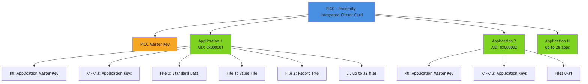
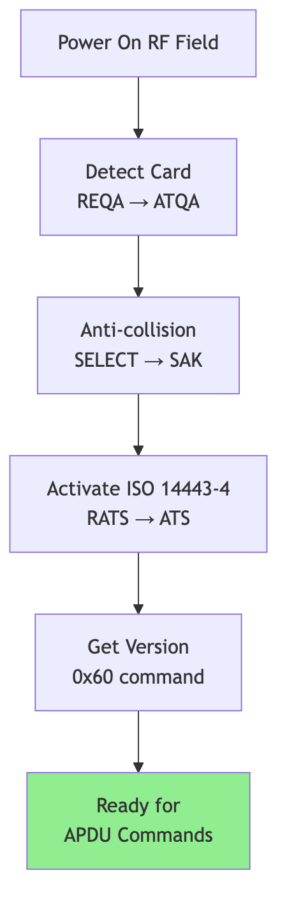

# DESFire Communication Protocol Diagrams

This folder contains rendered images of all Mermaid diagrams from the **COMMUNICATION_PROTOCOL.md** document.

Each diagram is available in two formats:
- **PNG** - High-resolution bitmap (2x scale) with transparent background
- **SVG** - Scalable vector graphics for maximum quality at any size

---

## Diagram Index

### 1. Card Hierarchy (`01-card-hierarchy`)

**Type**: Graph Diagram
**Section**: 1.3 Card Hierarchy
**Description**: Visual representation of the DESFire card structure showing PICC (Proximity Integrated Circuit Card) with multiple applications, keys, and files. Color-coded to show different levels of the hierarchy.

**Key Elements**:
- PICC master key at card level
- Applications (up to 28)
- Application master keys and file keys
- File structures (Standard Data, Value, Record)



---

### 2. Communication Flow (`02-communication-flow`)

**Type**: Sequence Diagram
**Section**: 2.2 Communication Flow
**Description**: Complete initialization sequence from RF field activation through ISO 14443-4 protocol establishment to APDU communication readiness.

**Key Steps**:
1. RF Field activation
2. REQA/ATQA (card detection)
3. Anti-collision (UID retrieval)
4. SELECT/SAK (card selection)
5. RATS/ATS (protocol activation)
6. APDU communication loop


---

### 3. Additional Frame Mechanism (`03-additional-frame`)

**Type**: Sequence Diagram
**Section**: 5.3 Additional Frame Mechanism
**Description**: Multi-frame protocol for large data transfers using the ADDITIONAL_FRAME (0xAF) command and status code 0x91AF.

**Key Concepts**:
- Chunked data transfer
- Status code 0x91AF indicates more data
- Status code 0x9000 indicates completion
- Recursive frame fetching


---

### 4. DES/3DES Authentication (`04-des-authentication`)

**Type**: Sequence Diagram
**Section**: 6.3 Legacy DES/3DES Authentication (0x0A)
**Description**: Legacy challenge-response authentication protocol using DES or 3DES encryption with 8-byte random values.

**Protocol Steps**:
1. Reader sends Authenticate(KeyNo)
2. Card sends encrypted RndB
3. Reader decrypts, generates RndA, rotates RndB
4. Reader sends encrypted challenge
5. Card verifies, sends encrypted RndA'
6. Reader verifies and establishes authentication

**Security Note**: This protocol is deprecated and should only be used for legacy compatibility.


---

### 5. AES Authentication (`05-aes-authentication`)

**Type**: Sequence Diagram
**Section**: 6.4 AES Authentication (0xAA)
**Description**: AES-128 challenge-response authentication with 16-byte random values and session key derivation.

**Protocol Steps**:
1. Challenge-response with 16-byte randoms
2. Mutual authentication
3. Session key derivation:
   - KSesAuthENC (encryption key)
   - KSesAuthMAC (MAC key)

**Use Case**: Standard authentication method for EV1/EV2/EV3 cards.


---

### 6. EV2 First Authentication (`06-ev2-authentication`)

**Type**: Sequence Diagram
**Section**: 6.5 EV2 First Authentication (0x71) - Recommended
**Description**: Enhanced authentication protocol for DESFire EV2/EV3 cards with CMAC-based session key derivation and transaction identifier.

**Protocol Steps**:
1. AuthEV2First with capability exchange
2. Challenge-response with encryption
3. Transaction ID (TI) generation
4. CMAC-based session key derivation:
   - KSesAuthENC = CMAC(K, SV1)
   - KSesAuthMAC = CMAC(K, SV2)

**Advantages**:
- Enhanced security with CMAC
- Transaction tracking with TI
- Protection against replay attacks

**Recommendation**: This is the **recommended** authentication method for EV2/EV3 cards.


---

### 7. Card Initialization (`07-card-initialization`)

**Type**: Flowchart
**Section**: 10.1 Card Initialization Flow
**Description**: Step-by-step initialization process from powering on the RF field to having a card ready for APDU commands.

**Sequence**:
1. Power On RF Field
2. Detect Card (REQA → ATQA)
3. Anti-collision (SELECT → SAK)
4. Activate ISO 14443-4 (RATS → ATS)
5. Get Version (0x60 command)
6. Ready for APDU Commands



---

### 8. Application Creation (`08-application-creation`)

**Type**: Sequence Diagram
**Section**: 10.2 Application Creation Flow
**Description**: Complete workflow for creating and provisioning a new application on a DESFire card.

**Steps**:
1. Select PICC level (AID 0x000000)
2. Authenticate with PICC master key
3. Create new application with specified AID
4. Select newly created application
5. Authenticate with factory default key
6. Change master key from default to secure key
7. Create files (data, value, record)

**Security Best Practice**: Always change default keys immediately after application creation.


---

### 9. Payment Transaction (`09-payment-transaction`)

**Type**: Sequence Diagram
**Section**: 10.3 Payment Transaction Flow
**Description**: Complete payment flow with balance verification, debit operation, transaction logging, and error handling.

**Normal Flow**:
1. Select payment application
2. Authenticate with EV2 First
3. Get current balance
4. Verify sufficient funds
5. Debit amount
6. Write transaction record
7. Commit transaction

**Error Handling**:
- Insufficient balance → Abort transaction
- Any error → Abort transaction to rollback changes

**Transaction Safety**: Uses atomic commit/abort pattern to ensure data consistency.


---

### 10. Key Change Flow (`10-key-change-flow`)

**Type**: Sequence Diagram
**Section**: 10.4 Key Change Flow
**Description**: Secure key change procedure using EV2 method with session key encryption.

**Steps**:
1. Select application
2. Authenticate with current key (establishes session keys)
3. Send ChangeKeyEV2 command with:
   - New key encrypted with session encryption key
   - Key version number
   - CRC32 for integrity verification
4. Card decrypts, verifies, and updates key

**Security Features**:
- New key encrypted with session key
- CRC32 integrity check
- Protected against interception


---

### 11. Key Rollover (Zero-Downtime) (`11-key-rollover`)

**Type**: Flowchart
**Section**: 10.5 Key Rollover Flow (Zero-Downtime)
**Description**: Advanced key rotation workflow for EV2/EV3 cards that allows zero-downtime key updates using keysets.

**Steps**:
1. **Initialize New Keyset** - Prepare keyset 1
2. **Change All Keys** - Update all keys in new keyset
3. **Roll to New Keyset** - Atomic switch (both keysets active)
4. **Update All Readers** - Deploy new keys to all systems
5. **Finalize** - Remove old keyset

**Advantages**:
- Zero downtime during key rotation
- Both old and new keys work during transition
- Atomic keyset switching
- Graceful migration period

**Critical States**:
- Yellow (transition): Both keysets active
- Green (complete): Old keys removed


---

## File Formats

### PNG Files
- **Resolution**: 2x scale for high quality
- **Background**: Transparent
- **Use Case**: Documentation, presentations, web display
- **File Size**: 50KB - 250KB per diagram

### SVG Files
- **Format**: Scalable Vector Graphics
- **Background**: Transparent
- **Use Case**: Print materials, high-resolution displays, editing
- **File Size**: 13KB - 28KB per diagram
- **Advantage**: Infinite scaling without quality loss

### Source Files (.mmd)
- **Format**: Mermaid markdown syntax
- **Use Case**: Editing diagrams, version control, regeneration
- **Can be edited**: Yes, with any text editor
- **Can be re-rendered**: Yes, using the render script

---

## Regenerating Diagrams

If you need to regenerate the diagrams (e.g., after editing the source):

```bash
# From the repository root
node render-diagrams.js
```

This will:
1. Extract all Mermaid diagrams from `COMMUNICATION_PROTOCOL.md`
2. Save source `.mmd` files
3. Render to PNG (high-resolution)
4. Render to SVG (scalable)

**Requirements**:
- Node.js installed
- Internet connection (for npx to download mermaid-cli)

---

## Using Diagrams in Documentation

### Markdown

```markdown

```

### HTML

```html
<!-- PNG for standard display -->


<!-- SVG for scalable display -->

```

### LaTeX

```latex
\includegraphics[width=\textwidth]{diagrams/01-card-hierarchy.png}
```

---

## Diagram Statistics

| Diagram | Type | Nodes/Steps | Format Sizes (PNG/SVG) |
|---------|------|-------------|------------------------|
| 01-card-hierarchy | Graph | 19 nodes | 101KB / 23KB |
| 02-communication-flow | Sequence | 8 steps | 99KB / 20KB |
| 03-additional-frame | Sequence | 6 steps | 81KB / 19KB |
| 04-des-authentication | Sequence | 6 steps | 153KB / 24KB |
| 05-aes-authentication | Sequence | 6 steps | 163KB / 24KB |
| 06-ev2-authentication | Sequence | 6 steps | 169KB / 24KB |
| 07-card-initialization | Flowchart | 6 nodes | 55KB / 13KB |
| 08-application-creation | Sequence | 13 steps | 211KB / 28KB |
| 09-payment-transaction | Sequence | 15 steps | 245KB / 28KB |
| 10-key-change-flow | Sequence | 7 steps | 129KB / 24KB |
| 11-key-rollover | Flowchart | 11 nodes | 141KB / 24KB |

**Total**: 11 diagrams, 22 PNG files, 22 SVG files, 11 source files

---

## License

These diagrams are part of the DESFire Communication Protocol documentation and follow the same license as the parent project.

---

**Generated**: 2025-10-29
**Tool**: Mermaid CLI (@mermaid-js/mermaid-cli)
**Source**: COMMUNICATION_PROTOCOL.md
